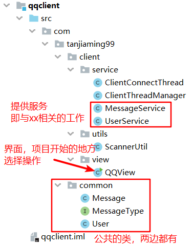
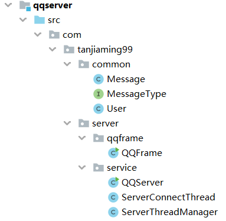
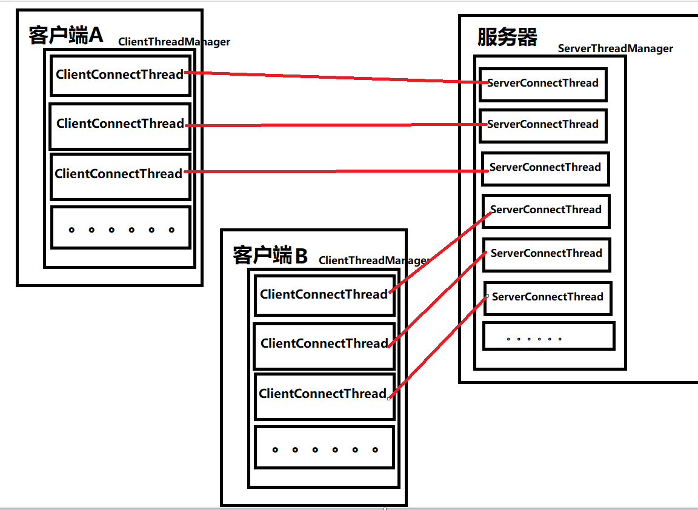

### 项目描述

这是一个使用Java完成的即时聊天小项目，是个人在学习Java网络编程相关知识时，根据[韩顺平老师的视频](https://space.bilibili.com/651245581/)制作而成。

非常适合**学习完JavaSE**的朋友一同学习，所需要的技术仅限于此，范围不大。（只不过有一点麻烦【x】）

先运行QQServer，然后运行多个QQView，账号密码如下。

```java
static {
    validUsers.put("100", new User("100", "123456"));
    validUsers.put("200", new User("200", "123456"));
    validUsers.put("300", new User("300", "123456"));
    validUsers.put("至尊宝", new User("至尊宝", "123456"));
    validUsers.put("紫霞仙子", new User("紫霞仙子", "123456"));
}
```

### 已实现的功能

1. 控制台界面

   没有制作Java图形化界面，据我以前做课设的经验，这个图形化界面会占用项目相当大的一部分的时间，得不偿失。

   控制台界面虽然看着很low，但五脏俱全，该有的功能也有，很方便接下来的拓展。

2. 私聊

   可以给某个在线的用户聊天，这里一次只聊一句，可以再改进。

3. 离线私聊

   可以给某个不在线的用户聊天，当其上线时会收到消息。

4. 群聊

   给除自己以外的所有在线用户发送消息。

### 可实现的功能

突然想想自己大三下了才做得出来这个，惭愧。这个小项目可以补充很多功能，在此列举一下，若有缘人看到可以自行补充，完成课设or大作业还是可以的。（看个大概就好qwq学完网络编程那块你也可以做）但是我在此就不补充了，只是增加工作量而已，它的核心功能已经实现了，慢慢摸索肯定可以拓展的。

1. 保存聊天记录（存文件/存数据库）
2. 服务器广播消息（与群聊无异）
3. 发送文件（与发送消息有什么不同吗？）
4. 离线发送文件（与离线发送消息有什么不同吗？）
5. 单点登录（只允许一个用户在一个客户端中登录）
6. 美化界面（这个控制台太丑了，不过也能看【x）
7. ……

### 项目层次

首先是客户端



开启项目，从QQView开始，运行后展示控制台界面，选择想做的功能。

功能都写在xxxService中，比如私聊，它与Message相关（私聊就是传Message），所以它被放在MessageService中，其它同理。

与服务器相连接的ClientConnectThread，每登录一个用户就会开启一个线程，线程会被Manager存放到一个ConcurrentHashMap（一个容器）管理。

与他人交流，就是各种service功能的调用。




服务端也同理。

至于common包下的内容，则是两边规定的一些东西，比如传输消息使用Message对象封装才会接收，消息的类型就是你想做什么事，比如私聊、群聊，通过判断这些类型来选择相应的服务。


### 原理图



我理解的大概就是这么个意思，客户端的socket和服务器的socket连接，发消息其实就是socket之间的通信，比如传文件、传对象等等。

但是服务器不能聊天，只有和客户端才能聊天，所以说是客户端socket与服务器的socket连接上并收到消息后，从Manager集合中找到那个客户端与服务器相连的线程，通过它的socket发送出去。

说白了就是一个转发。

描述得很渣渣，但是。。。。它其实就是一个基础的socket通信，没什么花样的。

---

PS：这个项目，在视频里面说得很清楚，所以也不用看我的，虽然有注释，但毕竟乱，而且也是新手。但如果你有什么疑问的话，也可以向我提一下，我会尽我能力解答的23333333333333


